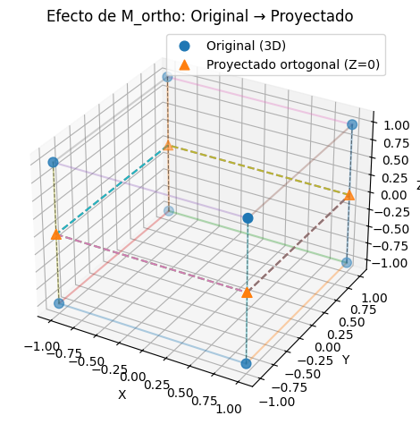
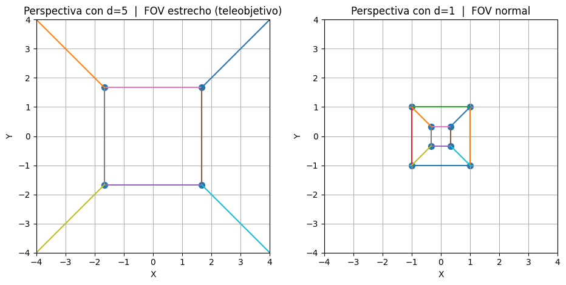
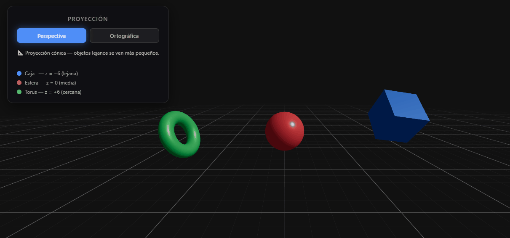
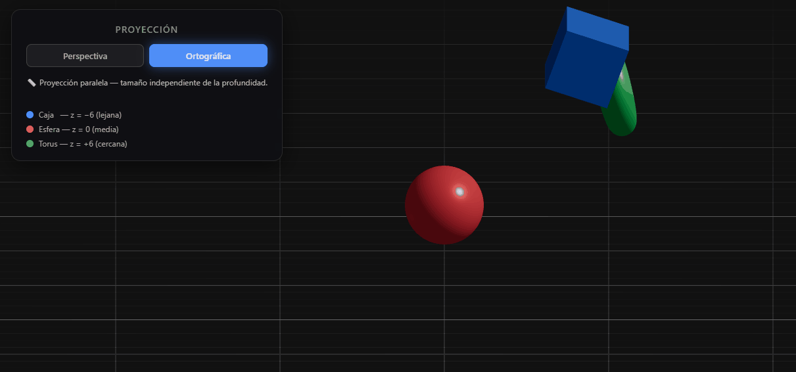
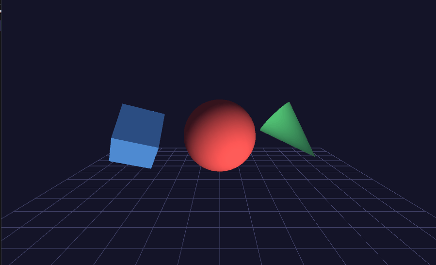
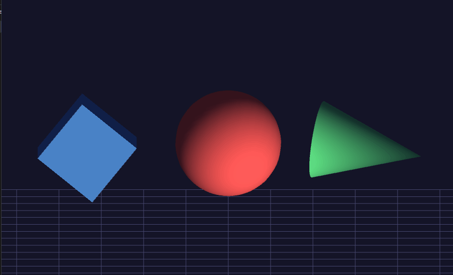

# Espacios Proyectivos y Matrices de Proyección

## Nombres

- Andres Felipe Galindo Gonzalez
- Stephan Alian Roland Martiquet Garcia
- Jose Arturo Rivera Herrera 
- Juan Camilo Lopez Bustos 
- Oscar Javier Martinez Martinez
- Melissa Dayana Forero Narváez 

## Fecha de entrega

`2026-02-27`

---

## Descripción breve

Comprender y aplicar los conceptos fundamentales de geometría proyectiva y el uso de matrices de proyección para representar escenas tridimensionales en un plano bidimensional, base esencial del pipeline gráfico moderno.

---

## Implementaciones

### Python

Se implementó un notebook Jupyter que explora los fundamentos de espacios proyectivos y matrices de proyección mediante visualizaciones interactivas con NumPy y Matplotlib. El notebook incluye:

- **Generación de geometría 3D**: Creación de un cubo definido por 8 vértices y sus 12 aristas.
- **Proyección Ortográfica**: Transformación de coordenadas 3D a 2D eliminando la profundidad, demostrando cómo todos los objetos mantienen su tamaño independientemente de su distancia.
- **Proyección Perspectiva**: Implementación de matrices de proyección que simulan perspectiva cónica, donde objetos lejanos aparecen más pequeños.
- **Coordenadas Homogéneas**: Uso de vectores homogéneos (x, y, z, w) para normalizar coordenadas proyectadas.
- **Visualización 3D**: Gráficos tridimensionales comparativos mostrando el cubo origina, sus proyecciones y efectos visuales.

### Three.js / React Three Fiber

Se desarrolló una aplicación interactiva en React con Three.js que compara visualmente proyecciones ortográficas y perspectivas en tiempo real. Características principales:

- **Objetos 3D Animados**: Tres geometrías diferentes (caja azul, esfera roja, torus verde) posicionadas a diferentes profundidades (z = -6, 0, +6) para demostrar el efecto de cada proyección.
- **Animación Continua**: Cada objeto rota a velocidades diferentes para mejorar la percepción de profundidad y movimiento.
- **Iluminación y Rendering**: Sistema de iluminación con luces ambientales, direccionales y puntuales; grid interactivo de fondo con OrbitControls para exploración.
- **Comparación Visual**: Al cambiar de proyección, es evidente cómo en perspectiva los objetos lejanos se encogen, mientras que en ortográfica se mantiene el tamaño relativo.

### Processing

Se implementó una visualización 3D en Processing que demuestra dinámicamente el cambio entre proyecciones. Incluye:

- **Objetos 3D**: Cubo, esfera y cono generados proceduralmente con rotaciones animadas para visualizar cómo responden a cada tipo de proyección.
- **Grid de Referencia**: Plano de cuadrícula que actúa como referencia para la perspectiva.
- **Control Interactivo**: Teclas p/o permiten cambiar entre proyección perspectiva (P3D) y ortográfica en tiempo real.
- **Iluminación Dinámica**: Luces ambiente y direccionales que realzan la percepción de profundidad y forma de los objetos.

---

## Resultados visuales

### Python - Implementación



Visualización 3D del cubo original con sus 8 vértices proyectados en el espacio tridimensional. Muestra la geometría base sobre la cual se aplicarán las diferentes matrices de proyección.



Visualización comparativa de dos proyecciones en perspectiva donde se modifica la distancia focal (d). Un valor mayor de d reduce la distorsión y comprime la profundidad visual, mientras que un valor menor amplía el campo de visión (FOV) y exagera la diferencia de tamaño entre objetos cercanos y lejanos.


### Three.js - Implementación



Visualización interactiva en proyección perspectiva de tres objetos 3D (caja, esfera y torus) animados a velocidades diferentes. Se aprecia claramente cómo los objetos se ven más pequeños según aumenta su distancia a la cámara.



Misma escena pero en proyección ortográfica. Los objetos mantienen su tamaño relativo independientemente de su profundidad (z). El cambio es evidente: en perspectiva los objetos lejanos se ven mas pequeñas, en ortográfica conservan su escala original.

### Processing - Implementación



Visualización de múltiples objetos (cubo, esfera y cono) en proyección perspectiva (modo P3D). Se observa la transformación realista donde la profundidad afecta el tamaño aparente de los objetos.



Misma escena en proyección ortográfica. Las geometrías se renderizan con proyección paralela, mostrando cómo todos los objetos mantienen proporciones consistentes sin deformación por perspectiva, permitiendo así una comparación directa entre ambos modos.

---

## Código relevante

### Python:

```python
# 8 vertices de un cubo centrado en el origen
vertices = np.array([
    [-1, -1, -1],
    [ 1, -1, -1],
    [ 1,  1, -1],
    [-1,  1, -1],
    [-1, -1,  1],
    [ 1, -1,  1],
    [ 1,  1,  1],
    [-1,  1,  1]
], dtype=float)

# aristas del cubo
edges = [
    (0,1),(1,2),(2,3),(3,0), 
    (4,5),(5,6),(6,7),(7,4), 
    (0,4),(1,5),(2,6),(3,7) 
]
```

### Three.js:

```jsx
export default function Scene() {
  return (
    <>
      {/* iluminación */}
      <ambientLight intensity={0.4} />
      <directionalLight position={[10, 10, 5]} intensity={1.5} castShadow />
      <pointLight position={[-10, -5, -5]} intensity={0.6} color="#aae" />

      {/* objeto lejano: caja - z = -6 */}
      <AnimatedMesh speed={0.3}>
        <mesh position={[-2.5, 0, -6]}>
          <boxGeometry args={[2, 2, 2]} />
          <meshStandardMaterial color="#4f8ef7" />
        </mesh>
      </AnimatedMesh>

      {/* objeto medio: esfera - z = 0 */}
      <AnimatedMesh speed={0.5}>
        <mesh position={[0, 0, 0]}>
          <sphereGeometry args={[1.2, 64, 64]} />
          <meshStandardMaterial color="#f75f5f" />
        </mesh>
      </AnimatedMesh>
    </>
  )
}
```

### Processing:

```processing
boolean usePerspective = true;
float t = 0;

void applyProjection() {
  if (usePerspective) {
    float fov    = PI / 3.0;
    float aspect = float(width) / float(height);
    perspective(fov, aspect, 1, 5000);
  } else {
    float s = 2.8;
    ortho(-width / s, width / s,
          -height / s, height / s,
          1, 5000);
  }
}

void keyPressed() {
  if (key == 'p' || key == 'P') {
    usePerspective = true;
  } else if (key == 'o' || key == 'O') {
    usePerspective = false;
  }
}
```

---

## Prompts utilizados

- "Explícame qué son las coordenadas homogéneas y por qué se usan en gráficos 3D. Dame un ejemplo numérico con un punto en 3D y cómo se representa en coordenadas homogéneas."
- "¿Cuál es la diferencia matemática entre una matriz de proyección ortográfica y una perspectiva? Muéstrame las matrices explícitas."
- "Usando NumPy, ayúdame a implementar una función que aplique una matriz de proyección perspectiva a un conjunto de vértices 3D en coordenadas homogéneas. Los vértices son los 8 puntos de un cubo centrado en el origen."

---

## Aprendizajes y dificultades

Este taller consolidó conceptos fundamentales de geometría proyectiva y su aplicación práctica en diferentes plataformas. La implementación en tres lenguajes distintos (Python, JavaScript/Three.js y Processing) permitió entender desde perspectivas diferentes cómo las matrices de proyección transforman coordenadas 3D a 2D, un concepto central en gráficos computacionales.

### Aprendizajes

- **Matrices de Proyección**: Se comprendió profundamente cómo las matrices ortográfica y perspectiva actúan sobre coordenadas homogéneas para producir la ilusión de profundidad o paralelismo.
- **Coordenadas Homogéneas**: El uso de coordenadas 4D (x, y, z, w) para normalizar proyecciones es un concepto potente que simplifica transformaciones afines.
- **Diferencias entre Proyecciones**: La proyección ortográfica es útil en CAD y diseño técnico, mientras que la perspectiva replica la visión humana, esencial en gráficos realistas.
- **Implementación Multiplataforma**: Aprender a expresar el mismo concepto en Python (NumPy), Three.js (React) y Processing reveló patrones comunes y diferencias de implementación.
- **Visualización Interactiva**: El uso de controles interactivos (botones en React, teclas en Processing) facilita la comprensión del impacto de cada proyección de forma inmediata.

### Dificultades

La principal complejidad residió en asegurar consistencia visual entre las tres implementaciones. Inicialmente, los parámetros de cámara (FOV, posición, distancia cerca/lejos) diferían entre plataformas, causando visualizaciones inconsistentes. Se resolvió ajustando cuidadosamente los valores de perspectiva en cada implementación para que mostraran el mismo comportamiento. La visualización de coordenadas homogéneas en 2D fue otro desafío; la normalización (x/w, y/w) debía implementarse correctamente o las proyecciones aparecían distorsionadas.

### Mejoras futuras

- Agregar más tipos de objetos 3D (pirámides, cilindros complejos) para demostrar que las matrices funcionan universalmente.
- Implementar una matriz de proyección personalizada donde el usuario ajuste FOV, near/far planes dinámicamente.
- Documentar las matrices matemáticas explícitamente en las visualizaciones.
- Crear ejemplos comparativos de frustrums (volúmenes de visión) para entender mejor near/far clipping planes.

---

## Contribuciones grupales (si aplica)

Trabajo grupal, apoorte realizado por Melissa Forero:

```markdown
- Implementé las matrices de proyección (ortográfica y perspectiva) en Python con NumPy
- Generé las visualizaciones 3D comparativas con Matplotlib en Jupyter
- Desarrollé la aplicación interactiva en React + Three.js/React Three Fiber con interfaz de usuario
- Programé la visualización en Processing con cambio dinámico entre proyecciones
- Crree los GIFs y captura de pantallas para documentar los resultados
- Documenté el README con explicaciones técnicas y aprendizajes
```

---

## Estructura del proyecto

```
semana_XX_Y_nombre_taller/
├── python/          # Código Python (si aplica)
├── unity/           # Proyecto Unity (si aplica)
├── threejs/         # Código Three.js/React (si aplica)
├── processing/      # Código Processing (si aplica)
├── media/           # OBLIGATORIO: Imágenes, videos, GIFs
└── README.md        # Este archivo
```

---

## Referencias

- Documentación oficial de NumPy y Matplotlib: https://numpy.org/ y https://matplotlib.org/
- Tutorial de React Three Fiber: https://docs.pmnd.rs/react-three-fiber/
- Documentación oficial de Processing: https://processing.org/reference/
- "Computer Graphics: Principles and Practice" - Foley, van Dam, Feiner, Hughes
- Documentación de Three.js: https://threejs.org/docs/
- Khan Academy - Linear Algebra (Vectores y Matrices): https://www.khanacademy.org/
- Paper: "Homogeneous Coordinates and Computer Graphics" - OpenGL Insights

---
