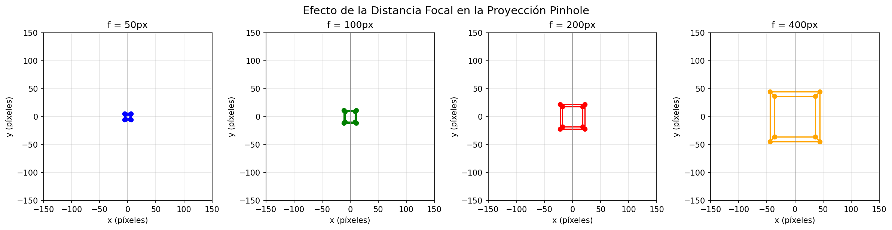
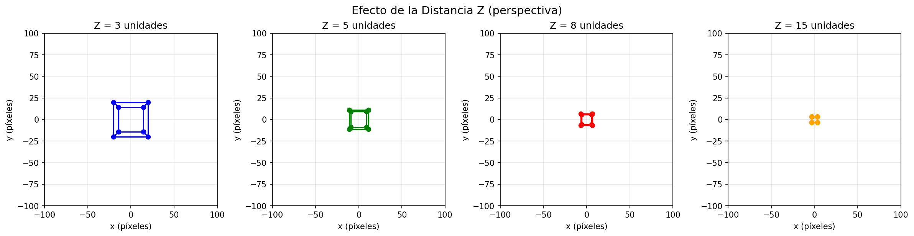
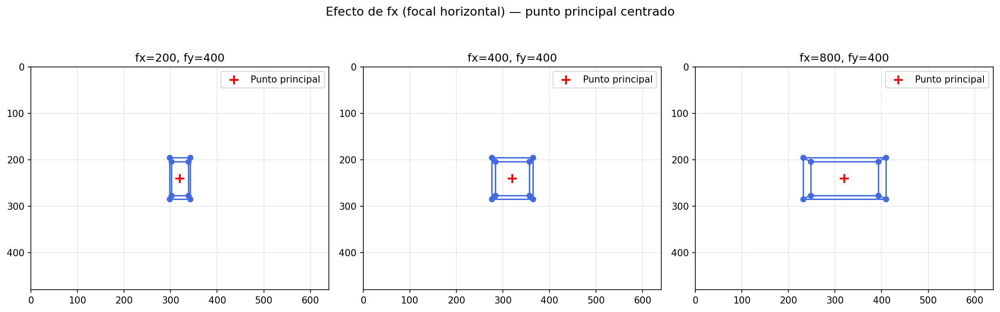
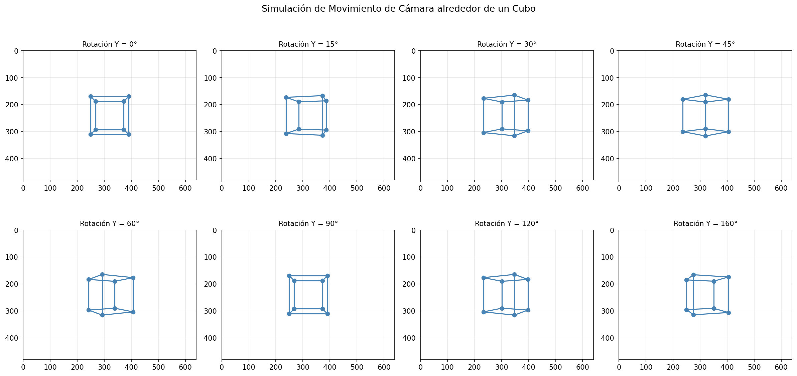
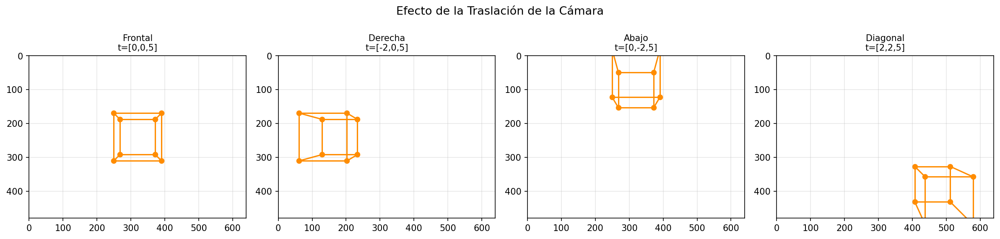
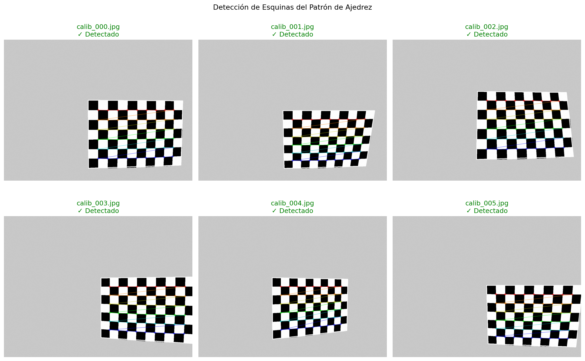
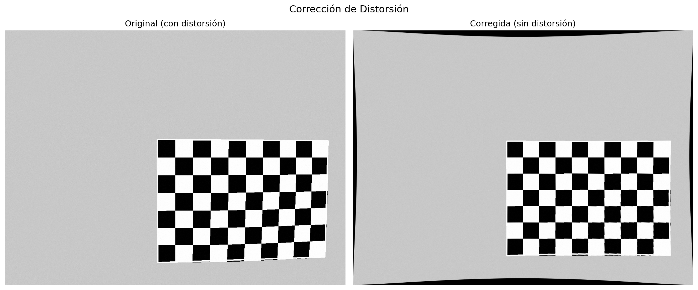
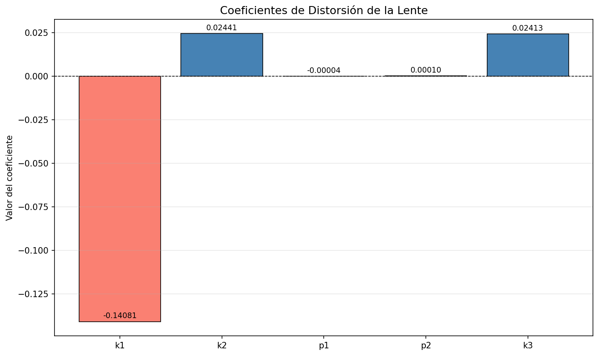

# Taller — Modelo de cámara Pinhole y calibración

> **Asignatura:** Computación Visual

> **Nombre de los integrantes:**

1. Forero Narvaez, Melissa Dayanna
2. ALINDO GONZÁLEZ, ANDRÉS FELIPE
3. Garcia Martiquet, Stephan Alain Roland
4. Herrera Rivera, Jose Arturo
5. Lopez Bustos, Juan Camilo
6. Martinez Martinez, Oscar Javier

> **Fecha de entrega:** 27 de Febrero del 2026

---

## Tabla de contenidos

1. [Descripción del taller](#1-descripción-del-taller)
2. [Fundamento teórico](#2-fundamento-teórico)
   - 2.1 [La Cámara como ojo matemático](#21-la-cámara-como-ojo-matemático)
   - 2.2 [El modelo Pinhole](#22-el-modelo-pinhole)
   - 2.3 [La distancia Focal](#23-la-distancia-focal)
   - 2.4 [La matriz intrínseca K](#24-la-matriz-intrínseca-k)
   - 2.5 [Parámetros extrínsecos R y t](#25-parámetros-extrínsecos-r-y-t)
   - 2.6 [Distorsión de lente](#26-distorsión-de-lente)
   - 2.7 [Calibración de cámara](#27-calibración-de-cámara)
   - 2.8 [Error de reproyección](#28-error-de-reproyección)
3. [Estructura del proyecto](#3-estructura-del-proyecto)
4. [Implementaciones python (OpenCV)](#4-implementaciones-python-opencv)
   - 4.1 [Modelo Pinhole básico](#41-modelo-pinhole-básico-01_pinhole_modelpy)
   - 4.2 [Parámetros intrínsecos](#42-parámetros-intrínsecos-02_intrinsic_matrixpy)
   - 4.3 [Parámetros extrínsecos](#43-parámetros-extrínsecos-03_extrinsic_paramspy)
   - 4.4 [Calibración con patrón](#44-calibración-con-patrón-04_calibrationpy)
   - 4.5 [Corrección y validación](#45-corrección-y-validación-05_undistort_validationpy)
   - 4.6 [Scripts auxiliares](#46-scripts-auxiliares)
5. [Implementación Three.js](#5-implementación-threejs)
   - 5.1 [Escena 3D](#51-escena-3d-scenesetupjs)
   - 5.2 [Cámara y parámetros](#52-cámara-y-parámetros-camerariggs)
   - 5.3 [Proyección 3D a 2D](#53-proyección-3d-a-2d-projectionoverlayjs)
   - 5.4 [Frustum de cámara](#54-frustum-de-cámara-frustumhelperjs)
   - 5.5 [Distorsión radial](#55-distorsión-radial-distortionpassjs)
6. [Resultados visuales](#6-resultados-visuales)
7. [Flujo de ejecución](#7-flujo-de-ejecución)
8. [Requisitos e instalación](#8-requisitos-e-instalación)
9. [Código relevante](#9-código-relevante)
10. [Prompts utilizados](#10-prompts-utilizados)
11. [Aprendizajes y dificultades](#11-aprendizajes-y-dificultades)
12. [Glosario](#12-glosario)
13. [Referencias](#13-referencias)

---

## 1. Descripción del taller

Este taller implementa el modelo matemático de cámara pinhole tanto en Python (con OpenCV y NumPy) como en Three.js (navegador). El objetivo central es responder una pregunta importante en visión por computador:

> **¿Cómo convierte una cámara el mundo tridimensional en una imagen bidimensional, y cómo podemos modelar matemáticamente esa transformación para hacer mediciones precisas?**

La respuesta incluye el modelo de cámara pinhole, los parámetros intrínsecos y extrínsecos, la corrección de distorsiones de lente, y el proceso de calibración que permite obtener todos esos parámetros a partir de fotografías de un patrón de ajedrez conocido.

**Aplicaciones reales de estos conceptos:**

- **Vehículos autónomos** (Tesla, Waymo) — estimación de distancias y trayectorias
- **Robótica** — manipulación de objetos con brazos robóticos
- **Realidad Aumentada** (ARKit, ARCore) — superposición de objetos virtuales
- **Medicina** — cirugía guiada por imagen y reconstrucción 3D de órganos
- **Videojuegos** — proyección de escenas 3D en pantalla
- **Metrología industrial** — medición de piezas con precisión de micras

---

## 2. Fundamento teórico

### 2.1 La cámara como ojo matemático

Una cámara digital colapsa el mundo 3D en una superficie 2D (el sensor). Al hacerlo, pierde información de profundidad: no se puede saber si una pelota en una foto es pequeña y cercana, o grande y lejana. Esta ambigüedad es el reto central que la calibración de cámara ayuda a resolver; ya que es similar a ver la sombra que se genera sobre una superficie al enfocar una linterna sobre un cuerpo 3D.

### 2.2 El modelo Pinhole

El modelo pinhole es la aproximación fundamental de cómo funciona una cámara. Imagina una caja oscura con un agujero microscópico: la luz entra en línea recta y proyecta una imagen invertida en la pared opuesta.

```
         Mundo 3D           Agujero      Plano de imagen
                            (pinhole)
    P(X,Y,Z) ──────────────── O ──────────── p(x,y)
                               │← f →│
```

La proyección se expresa con dos ecuaciones:

```
x = f · (X / Z)
y = f · (Y / Z)
```

**¿Por qué dividir por Z?** Porque objetos más lejanos aparecen más pequeños — exactamente como los rieles de un tren que parecen converger en el horizonte. Es la perspectiva matemática Z es la distancia de la cámara hasta el objetivo por lo tanto matemáticamente, cuanto mas grande sea Z, es decir, mas lejos este el objetivo; mas pequeño se dibujara en la foto.

### 2.3 La Distancia Focal

La distancia focal `f` controla cuánto "acerca" la cámara los objetos, o en el modelo Pinhole que tan lejos esta el agujero (pinhole) del fondo de la caja (el sensor):

- **f pequeña** → campo de visión amplio (gran angular) → como un objetivo de 24mm; esto significa que el sensor esta muy cerca del agujero, es como ver a traves de una ventana estando pegado al vidrio, es ideal para paisajes.
- **f grande** → campo de visión estrecho (teleobjetivo) → como un objetivo de 400mm; en este caso la el agujero esta lejos del sensor por lo que la cámara solo ve un trozo de lo que hay afuera, pero se ve muy grande, como si se mirara por medio de un rollo de papel de cocina, este enfoque es util para fotos de precision con deportes o naturaleza.

### 2.4 La matriz intrínseca K

Una cámara real introduce complejidades que el modelo básico ignora: los píxeles pueden no ser cuadrados, el centro óptico no siempre está al centro de la imagen, y el origen está en la esquina superior izquierda. Todo esto se encapsula en la **Matriz Intrínseca K**:

```
    ┌              ┐
    │ fx   0   cx  │
K = │  0   fy  cy  │
    │  0   0    1  │
    └              ┘
```

| Parámetro  | Significado                                                                   |
| ---------- | ----------------------------------------------------------------------------- |
| `fx`, `fy` | Distancia focal en píxeles (horizontal y vertical)                            |
| `cx`, `cy` | Punto principal — donde el eje óptico cruza el sensor (≈ centro de la imagen) |

La proyección completa con K:

```
u = fx · (X/Z) + cx
v = fy · (Y/Z) + cy
```

La matriz intrínseca define en cierta manera como la cámara funciona internamente, los valores de los focales se encuentran en pixeles, ya que en el mundo real se mide la lente en milímetros, pero la computadora comprende en términos de pixeles, estos valores traducen el tamaño de la lente a cuántos pixeles ocupa la imagen. Es común creer que el centro de la lente apunta directamente al centro del sensor de la imagen, pero esto en realidad no ocurre por errores milimétricos en el montaje, por lo que `cx`, `cy` le indica a la computadora hacia donde esta movido el centro de la imagen.

### 2.5 Parámetros extrínsecos R y t

Los parámetros extrínsecos describen la **posición y orientación de la cámara en el mundo**:

- **R (Matriz de Rotación 3×3):** hacia dónde apunta la cámara
- **t (Vector de Traslación 3×1):** dónde está la cámara en el espacio

```
P_cam = R · P_world + t
p_img = K · (R · P_world + t) / Z_cam
```

**Analogía:** eres fotógrafo en un museo. La escultura no se mueve (es el "mundo"), pero tú puedes cambiar tu posición (t) y orientación (R) para fotografiarla desde distintos ángulos.

Las tres rotaciones elementales corresponden a movimientos de un avión:

- **Pitch o Cabeceo (eje X):** cabeza arriba/abajo
- **Yaw o Guiñada (eje Y):** nariz izquierda/derecha
- **Roll o Alabeo (eje Z):** ala izquierda sube, derecha baja

### 2.6 Distorsión de Lente

Los lentes reales no son perfectos: introducen distorsiones que hacen que líneas rectas aparezcan curvas, como la lente de la cámara es curva y el sensor es plano, la luz se "dobla" de forma desigual al pasar por los bordes, pero existen dos tipos de distorsiones principales.

#### Distorsión de barril


#### Distorsión de cojin


El modelo matemático de distorsión radial:

```
x_dist = x · (1 + k1·r² + k2·r⁴ + k3·r⁶)
y_dist = y · (1 + k1·r² + k2·r⁴ + k3·r⁶)
```

El vector de distorsión completo: `dist = [k1, k2, p1, p2, k3]`
donde `k1, k2, k3` son coeficientes radiales y `p1, p2` son de distorsión tangencial.
Los coeficientes de distorsión son los "correctores" matemáticos que compensan las imperfecciones físicas de cualquier lente. Como ninguna lente es un cristal perfecto y plano, estos números le dicen a la computadora cómo "enderezar" la imagen.

### 2.7 Calibración de cámara

Calibrar significa **estimar K y dist** a partir de imágenes de un patrón de ajedrez cuya geometría se conoce perfectamente.
¿Por qué usamos un tablero de ajedrez? Porque la computadora es muy buena encontrando esquinas y, lo más importante, nosotros ya sabemos cuánto miden los cuadrados en la vida real (por ejemplo, 2.5 cm).El proceso paso a paso:

1. **Definir puntos del mundo:** las esquinas del ajedrez con Z=0 (patrón plano),
2. **Detectar esquinas:**
   `cv2.findChessboardCorners()` : Encuentra los puntos gordos.<br>
   `cv2.cornerSubPix()` : Es como usar una lupa, donde no solo dice "está en el píxel 10", sino "está en el píxel 10.45", usar la precisión extra es importante. <br>
   `cv2.findChessboardCorners()` + refinamiento subpíxel con `cv2.cornerSubPix()`
3. **Acumular correspondencias:** La computadora hace una lista: "La esquina real (0,0,0) en la foto 1 está en el píxel (120, 450); en la foto 2 está en el píxel (300, 200)...", para cada imagen, el par (puntos_3D_mundo, puntos_2D_imagen)
4. **Resolver con OpenCV:** `cv2.calibrateCamera()` usa el método de Zhang (2000) — solución lineal aproximada refinada con Levenberg-Marquardt. Al tener muchas fotos del mismo objeto desde ángulos raros, la computadora puede deducir: "Para que esta esquina se vea así de torcida en esta foto, la lente DEBE tener esta distorsión y este centro óptico".

Se recomiendan 10-20 imágenes con variedad de ángulos, distancias y posiciones del patrón.

### 2.8 Error de Reproyección

Mide la calidad de la calibración: se reproyectan los puntos 3D conocidos usando los parámetros estimados y se comparan con las esquinas detectadas originalmente.

```python
proj_pts, _ = cv2.projectPoints(obj_pts, rvec, tvec, K, dist)
error = np.sqrt(np.mean(np.sum((proj_pts - img_pts)**2, axis=1)))
```

#### Error modelo en Python


| Error          | Calidad                                                      |
| -------------- | ------------------------------------------------------------ |
| `< 0.5 px`     | Excelente — apto para metrología de precisión                |
| `0.5 - 1.0 px` | Buena — suficiente para la mayoría de aplicaciones           |
| `> 1.0 px`     | Mejorable — revisar calidad de imágenes o agregar más vistas |

---

## 3. Estructura del Proyecto

- Se cumple con las indicaciones del docente.

---

## 4. Implementaciones Python (OpenCV)

### 4.1 Modelo Pinhole básico (`01_pinhole_model.py`)

Implementa la proyección perspectiva desde cero usando **solo NumPy y Matplotlib**, sin ninguna librería de visión por computador.

**¿Qué hace?**

- Define la función de proyección pinhole pura `x = f·X/Z`
- Crea un cubo 3D de 8 vértices y 12 aristas
- Experimento 1: proyecta el cubo con 4 distancias focales distintas `[50, 100, 200, 400]`
- Experimento 2: proyecta el cubo a 4 distancias Z distintas `[3, 5, 8, 15]`

**Código clave:**

```python
def project_pinhole(points_3d, focal_length):
    X = points_3d[:, 0]
    Y = points_3d[:, 1]
    Z = points_3d[:, 2]
    Z = np.where(Z == 0, 1e-6, Z)      # Evitar división por cero
    x_proj = focal_length * X / Z       # ← Ecuación pinhole en X
    y_proj = focal_length * Y / Z       # ← Ecuación pinhole en Y
    return np.stack([x_proj, y_proj], axis=1)
```

**Lo que se evidencia:**

- A mayor `f`, el cubo se ve más grande (más zoom)
- A mayor Z, el cubo se ve más pequeño (perspectiva)
- La proyección es no-lineal: duplicar Z no reduce el tamaño a la mitad exactamente cuando el cubo tiene profundidad

---

### 4.2 Parámetros Intrínsecos (`02_intrinsic_matrix.py`)

Muestra cómo cada parámetro de la matriz K afecta la imagen de forma independiente.

**¿Qué hace?**

- Construye K explícitamente con `build_K(fx, fy, cx, cy)`
- Experimento 1: varía `fx ∈ {200, 400, 800}` con `fy=400` constante → muestra "stretch" horizontal
- Experimento 2: varía el punto principal `(cx, cy)` a tres posiciones → muestra desplazamiento del origen de perspectiva

**Código importante:**

```python
def build_K(fx, fy, cx, cy):
    return np.array([
        [fx,  0, cx],
        [ 0, fy, cy],
        [ 0,  0,  1]
    ], dtype=float)

def project_with_K(points_3d, K):
    x_norm = X / Z
    y_norm = Y / Z
    points_norm = np.stack([x_norm, y_norm, ones], axis=0)  # (3, N)
    p_pixel = K @ points_norm                                 # (3, N)
    return p_pixel[:2, :].T
```

> **Nota:** El eje Y está invertido en las visualizaciones (`ax.set_ylim(IMAGE_H, 0)`) porque en imágenes digitales el origen `(0,0)` está en la esquina superior izquierda.

**Lo que se evidencia:**

- Cuando `fx ≠ fy`, el cubo aparece estirado/comprimido horizontalmente
- El punto principal `(cx, cy)` es literalmente el "punto de fuga central" de toda la perspectiva
- Mover `(cx, cy)` equivale a "apuntar" el eje óptico en esa dirección

---

### 4.3 Parámetros Extrínsecos (`03_extrinsic_params.py`)

Separa los parámetros que dependen de la cámara (K) de los que dependen de su posición en el mundo (R, t).

**¿Qué hace?**

- Implementa rotaciones elementales `Rx, Ry, Rz` desde cero con trigonometría
- Implementa la proyección completa `project_full(points_world, K, R, t)`
- Experimento 1: rota la cámara alrededor del cubo en 8 ángulos (0° a 160°)
- Experimento 2: traslada la cámara en 4 direcciones distintas

**Código clave:**

```python
def rotation_y(angle_deg):
    a = np.radians(angle_deg)
    return np.array([
        [ np.cos(a), 0, np.sin(a)],
        [         0, 1,         0],
        [-np.sin(a), 0, np.cos(a)]
    ])

def project_full(points_world, K, R, t):
    # Paso 1: Mundo → Cámara
    P_cam = (R @ points_world.T).T + t
    Z = np.where(P_cam[:, 2] <= 0, 1e-6, P_cam[:, 2])
    # Paso 2: Normalizar y aplicar K
    x_norm = P_cam[:, 0] / Z
    y_norm = P_cam[:, 1] / Z
    p_norm = np.stack([x_norm, y_norm, np.ones_like(x_norm)], axis=0)
    return (K @ p_norm)[:2, :].T
```

**Lo que se evidencia:**

- Con R=I y t=[0,0,5]: imagen simétrica del cubo frontal
- Al rotar Y=90°: solo se ve una cara lateral del cubo
- La traslación lateral produce desplazamiento del cubo con leve cambio de perspectiva

---

### 4.4 Calibración con Patrón (`04_calibration.py`)

Aplica el proceso real de calibración donde todos los conceptos anteriores se unen.

**¿Qué hace?**

- Genera un patrón de ajedrez imprimible (10×7 cuadros)
- Detecta las 9×6 = 54 esquinas internas en cada imagen
- Calibra con `cv2.calibrateCamera()` y guarda K y dist

**Código clave:**

```python
# Definir puntos 3D del patrón (Z=0 porque es plano)
objp = np.zeros((ROWS * COLS, 3), dtype=np.float32)
objp[:, :2] = np.mgrid[0:COLS, 0:ROWS].T.reshape(-1, 2)
objp *= SQUARE_SIZE_MM  # Escalar a mm reales

# Detectar y refinar esquinas
ret, corners = cv2.findChessboardCorners(gray, (COLS, ROWS), None)
if ret:
    corners_refined = cv2.cornerSubPix(gray, corners, (11,11), (-1,-1), criteria)

# Calibrar
ret, K, dist, rvecs, tvecs = cv2.calibrateCamera(
    obj_points, img_points, img_shape, None, None
)
# ret = error RMS de reproyección
```

> **Distinción importante:** `CHESSBOARD_COLS=9` se refiere a **esquinas internas** (9 esquinas = 10 cuadros). Error común: confundir esquinas con cuadros.

**Lo que se evidencia:**

- El valor de `ret` (RMS error) en consola — bueno si < 1.0
- La matriz K impresa — verificar que `cx ≈ width/2` y `cy ≈ height/2`
- Los coeficientes `dist` — para imágenes sintéticas deben aproximarse a los valores reales

---

### 4.5 Corrección y Validación (`05_undistort_validation.py`)

Usa los parámetros calibrados para corregir imágenes y validar cuantitativamente la calibración.

**¿Qué hace?**

- Carga K y dist de los archivos `.npy`
- Aplica `cv2.undistort()` y muestra la comparación antes/después
- Calcula el error de reproyección por imagen
- Visualiza los coeficientes de distorsión en un gráfico de barras

**Código clave:**

```python
# alpha=1: conserva todos los píxeles (habrá bordes negros en esquinas)
# alpha=0: recorta para eliminar bordes negros
new_K, roi = cv2.getOptimalNewCameraMatrix(K, dist, (w, h), alpha=1)
undistorted = cv2.undistort(img, K, dist, None, new_K)

# Error de reproyección
proj_pts, _ = cv2.projectPoints(obj_pts, rvec, tvec, K, dist)
error = np.sqrt(np.mean(np.sum((proj_pts - img_pts)**2, axis=1)))
```

> `undistort` funciona por **backward mapping**: para cada píxel de la imagen corregida, calcula su ubicación en la imagen original distorsionada y copia su color.

**Lo que se evidencia:**

- Líneas que antes aparecían curvas ahora son rectas
- Error de reproyección por imagen (imágenes con ángulos extremos tienden a tener mayor error)
- Gráfico de barras de coeficientes: azul = positivo (cojín), salmón = negativo (barril)

---

### 4.6 Scripts auxiliares

**`capture_images.py`** — abre la webcam y guarda una imagen en `calibration_images/` cada vez que se presiona ESPACIO. Permite hacer el taller con una cámara real( no se empleo, pero se pudo haber incorporado).

**`generate_synthetic_calibration.py`** — genera automáticamente imágenes de calibración con distorsión controlada, sin necesidad de cámara física. Define una cámara sintética con K y dist conocidos, proyecta el patrón en 14 poses distintas usando `cv2.projectPoints` (que sí aplica distorsión radial), y verifica que las esquinas sean detectables.

---

## 5. Implementación Three.js

La implementación Three.js hace visible e interactivo el mismo modelo matemático, esta vez en el navegador con WebGL. Todos los parámetros son ajustables en tiempo real mediante un panel GUI.

#### Modelo en ThreeJS


Cada archivo implementa exactamente **una responsabilidad** del modelo pinhole (Principio de Responsabilidad Única):

| Archivo                | Responsabilidad               | Parámetros del modelo                |
| ---------------------- | ----------------------------- | ------------------------------------ |
| `SceneSetup.js`        | El "mundo" que se fotografía  | Puntos 3D de referencia              |
| `CameraRig.js`         | La cámara que fotografía      | K (intrínsecos), R y t (extrínsecos) |
| `ProjectionOverlay.js` | El resultado de la fotografía | `p = K·[R\|t]·P`                     |
| `FrustumHelper.js`     | El volumen visible            | Planos del frustum                   |
| `DistortionPass.js`    | Los defectos del lente        | k1, k2 (distorsión radial)           |

---

### 5.1 Escena 3D (`SceneSetup.js`)

Construye todo el contenido de la escena: renderer WebGL, iluminación, cinco objetos geométricos (cubo, esfera, cilindro, toro, icosaedro) y el sistema de marcadores de referencia.

**Marcadores anclados como hijos:**

```javascript
//marcador es hijo del objeto → rota con él
function addMarker(parent, x, y, z, name) {
  const marker = new THREE.Mesh(sphereGeom, yellowMat);
  marker.position.set(x, y, z); // Posición LOCAL relativa al padre
  parent.add(marker); // Hereda la transformación del padre
  referenceMarkers.push(marker);
}
addMarker(box, 0, 1, 0, "ref_cube_top"); // Siempre en el tope del cubo, aunque rote
```

Si se usara un `Vector3` estático en lugar de un objeto hijo, el marcador no seguiría al objeto cuando este rota — la proyección mostraría posiciones incorrectas.

---

### 5.2 Cámara y parámetros (`CameraRig.js`)

Implementa la `PerspectiveCamera` principal con `OrbitControls` y la función para calcular la focal length equivalente en píxeles.

**Relación FOV ↔ focal length:**

```javascript
function getFocalLengthPx() {
  renderer.getSize(size);
  const fovRad = THREE.MathUtils.degToRad(camera.fov);
  return size.y / 2 / Math.tan(fovRad / 2); // f = (h/2) / tan(α/2)
}
```

Se usa `renderer.getSize()` y no `window.innerHeight` porque si el canvas no ocupa toda la ventana, el tamaño de la ventana no coincide con el del canvas.

La amortiguación o damping de `OrbitControls` (`dampingFactor = 0.06`) añade inercia al movimiento: la cámara frena suavemente al soltar el mouse. Por esto es obligatorio llamar `controls.update()` en cada frame del loop.


---

### 5.3 Proyección 3D a 2D (`ProjectionOverlay.js`)

Implementa la parte central del modelo: convierte posiciones 3D (que siguen los objetos animados) en coordenadas 2D de pantalla y las dibuja como círculos etiquetados en un SVG overlay.

**La función `worldToScreen()` — la parte matemática:**

```javascript
function worldToScreen(point3D, camera) {
  tempVec.copy(point3D);
  tempVec.project(camera); // P_cam = R·P + t → NDC → píxeles

  const behind = tempVec.z > 1.0; // ¿El punto está detrás del far plane?

  // NDC [-1,1] → píxeles [0, width/height]
  const x = (tempVec.x + 1) * 0.5 * window.innerWidth;
  const y = (-tempVec.y + 1) * 0.5 * window.innerHeight; // ← Y invertido

  return { x, y, behind };
}
```

`.project(camera)` ejecuta internamente: `matrixWorldInverse` (R,t: mundo→cámara) → `projectionMatrix` (K: cámara→NDC) → división perspectiva. Es exactamente lo mismo que `cv2.projectPoints()` en OpenCV.

La inversión de Y es necesaria porque en Three.js Y positivo apunta hacia arriba, pero en pantalla/SVG Y positivo apunta hacia abajo.

---

### 5.4 Frustum de cámara (`FrustumHelper.js`)

Crea una segunda cámara (la "cámara virtual") cuyo frustum se dibuja como wireframe 3D dentro de la escena, y opcionalmente corta los objetos con precisión pixel-perfect usando los 6 planos del frustum como clipping planes de GPU.

```javascript
// El frustum tiene forma de pirámide truncada con 6 planos:
// Near, Far, Izquierdo, Derecho, Superior, Inferior
function applyFrustumCulling() {
  frustumMatrix.multiplyMatrices(
    virtualCam.projectionMatrix,
    virtualCam.matrixWorldInverse,
  );
  frustum.setFromProjectionMatrix(frustumMatrix);
  renderer.clippingPlanes = frustum.planes; // 6 planos a la GPU
}
```

La diferencia entre culling básico y clipping con planos: el básico solo elimina objetos completamente fuera del frustum, mientras que el clipping corta exactamente los objetos que están parcialmente dentro — pixel-perfect.

La cámara virtual orbita la escena animadamente:

```javascript
function animateFrustum(elapsed) {
  const angle = elapsed * 0.28;
  virtualCam.position.x = Math.cos(angle) * 10;
  virtualCam.position.z = Math.sin(angle) * 10;
  virtualCam.position.y = 3 + Math.sin(elapsed * 0.4) * 1.5;
  virtualCam.lookAt(0, 1, 0);
}
```

> `helper.update()` debe llamarse en cada frame — si no, el helper se "congela" cuando la cámara principal se mueve con OrbitControls.

---

### 5.5 Distorsión radial (`DistortionPass.js`)

Implementa un shader GLSL de post-procesado que simula distorsión radial de lente. La escena se renderiza primero a una textura offscreen y luego esa textura se redibuja con coordenadas deformadas.

**El fragment shader (ejecutado por la GPU, una vez por píxel):**

```glsl
void main() {
    vec2 c = vUv - 0.5;        // Centrar coordenadas en el óptico
    c.x *= aspect;              // Corrección de aspecto para distorsión circular

    float r2 = dot(c, c);       // r² = x² + y²

    // Modelo de distorsión radial de OpenCV:
    float factor = 1.0 + (k1 * r2 + k2 * r2 * r2) * strength;

    vec2 uv_dist = c * factor;
    uv_dist.x /= aspect;
    uv_dist += 0.5;

    if (uv_dist.x < 0.0 || uv_dist.x > 1.0 ||
        uv_dist.y < 0.0 || uv_dist.y > 1.0) {
        gl_FragColor = vec4(0.0, 0.0, 0.0, 1.0);  // Bordes negros
    } else {
        gl_FragColor = texture2D(tDiffuse, uv_dist);
    }
}
```

La corrección por `aspect` es necesaria para que la distorsión sea circular y no elíptica: las UVs tienen rango [0,1] en ambos ejes pero la pantalla es rectangular.

---

## 6. Resultados Visuales

### Python

| Experimento                                  | Resultado                                           |
| -------------------------------------------- | --------------------------------------------------- |
| Distancias focales `f = [50, 100, 200, 400]` | El mismo cubo aparece progresivamente más grande    |
| Distancias Z `[3, 5, 8, 15]`                 | El cubo se ve progresivamente más pequeño           |
| Variación de `fx` vs `fy`                    | El cubo aparece estirado/comprimido horizontalmente |
| Desplazamiento del punto principal           | El cubo se desplaza — el foco perspectivo cambia    |
| Rotación de cámara 0°–160°                   | Vista orbital del cubo en 8 poses                   |
| Detección de esquinas                        | Esquinas marcadas en verde sobre el patrón          |
| Undistort antes/después                      | Líneas que antes eran curvas ahora son rectas       |
| Coeficientes de distorsión                   | Gráfico de barras: `k1 < 0` (barril) en azul        |

**Galería de resultados Python:**


_Efecto de diferentes distancias focales sobre la proyección del cubo_


_Perspectiva: el mismo cubo proyectado a diferentes distancias_


_Variación de fx con fy constante — deformación de aspecto_


_Desplazamiento del punto principal (cx, cy) — origen de la perspectiva_


_Cámara rotando alrededor del cubo: 8 vistas de 0° a 160°_


_Efecto de diferentes traslaciones sobre la proyección_


_Esquinas del patrón de ajedrez detectadas y refinadas a nivel subpíxel_


_Comparación imagen original (izquierda) vs sin distorsión (derecha)_


_Gráfico de barras de los coeficientes k1, k2, p1, p2, k3_

### Three.js

| Funcionalidad                 | Resultado                                                  |
| ----------------------------- | ---------------------------------------------------------- |
| Escena 3D interactiva         | 5 objetos geométricos con iluminación y sombras            |
| Overlay de proyección         | Círculos amarillos con coordenadas (u,v) sobre cada objeto |
| Frustum wireframe             | Cono naranja orbitando la escena en tiempo real            |
| Frustum clipping              | Objetos cortados pixel-perfect por los planos del frustum  |
| Distorsión de barril (k1 < 0) | Imagen inflada hacia afuera, bordes curvos                 |
| Distorsión de cojín (k1 > 0)  | Imagen hundida hacia adentro                               |


_Interfaz Three.js: escena 3D con overlay de proyección, frustum y panel de parámetros_

---

## 7. Flujo de Ejecución

```
OPCIÓN A: Con imágenes reales (webcam)
──────────────────────────────────────
1. python 04_calibration.py          # Genera el patrón imprimible
2. python capture_images.py          # Captura fotos con webcam (mín. 15)
3. python 04_calibration.py          # Calibra con las fotos capturadas
4. python 05_undistort_validation.py # Valida y corrige distorsión

OPCIÓN B: Completamente sintético (sin cámara)
───────────────────────────────────────────────
1. python generate_synthetic_calibration.py  # Genera imágenes simuladas
2. python 04_calibration.py                  # Calibra
3. python 05_undistort_validation.py         # Valida

Conceptual (independiente del orden de ejecución):
────────────────────────────────────────────────────
python 01_pinhole_model.py       # Proyección básica
python 02_intrinsic_matrix.py    # Parámetros intrínsecos
python 03_extrinsic_params.py    # Parámetros extrínsecos

Three.js:
──────────
cd threejs
npm install
npm run dev
# Abrir http://localhost:5173
```

---

## 8. Requisitos e instalación

### Python

```bash
pip install numpy matplotlib opencv-python
```

Crear carpetas necesarias:

```bash
mkdir -p calibration_images media python
```

### Three.js

Requiere [Node.js](https://nodejs.org/) v16+.

```bash
cd threejs
npm install    # Instala three, lil-gui y vite
npm run dev    # Inicia servidor en http://localhost:5173
```

**Controles de navegación Three.js:**

| Acción             | Control                     |
| ------------------ | --------------------------- |
| Orbitar            | Click izquierdo + arrastrar |
| Zoom               | Rueda del mouse             |
| Pan                | Click derecho + arrastrar   |
| Ajustar parámetros | Panel derecho (GUI)         |

---

## 9. Código Relevante

### Proyección pinhole mínima (Python)

```python
def project_pinhole(points_3d, focal_length):
    X, Y, Z = points_3d[:, 0], points_3d[:, 1], points_3d[:, 2]
    Z = np.where(Z == 0, 1e-6, Z)
    return np.stack([focal_length * X / Z, focal_length * Y / Z], axis=1)
```

### Proyección completa mundo → imagen (Python)

```python
def project_full(points_world, K, R, t):
    P_cam = (R @ points_world.T).T + t
    Z = np.where(P_cam[:, 2] <= 0, 1e-6, P_cam[:, 2])
    p_norm = np.stack([P_cam[:,0]/Z, P_cam[:,1]/Z, np.ones(len(Z))], axis=0)
    return (K @ p_norm)[:2, :].T
```

### Calibración con OpenCV

```python
ret, K, dist, rvecs, tvecs = cv2.calibrateCamera(
    obj_points, img_points, img_shape, None, None
)
print(f"RMS error: {ret:.4f}")  # < 1.0 es bueno
print(f"K:\n{K}")
print(f"dist: {dist.flatten()}")
```

### worldToScreen en Three.js

```javascript
function worldToScreen(point3D, camera) {
  tempVec.copy(point3D);
  tempVec.project(camera); // Todo el pipeline K·[R|t]·P
  return {
    x: (tempVec.x + 1) * 0.5 * window.innerWidth,
    y: (-tempVec.y + 1) * 0.5 * window.innerHeight, // Y invertido
    behind: tempVec.z > 1.0,
  };
}
```

### Shader de distorsión (GLSL)

```glsl
void main() {
    vec2 c = vUv - 0.5;
    c.x *= aspect;
    float r2 = dot(c, c);
    float factor = 1.0 + (k1 * r2 + k2 * r2 * r2) * strength;
    vec2 uv_dist = c * factor;
    uv_dist.x /= aspect;
    uv_dist += 0.5;
    gl_FragColor = (uv_dist.x < 0.0 || uv_dist.x > 1.0 ||
                    uv_dist.y < 0.0 || uv_dist.y > 1.0)
                 ? vec4(0.0, 0.0, 0.0, 1.0)
                 : texture2D(tDiffuse, uv_dist);
}
```

---

## 10. Prompts Utilizados

Ejemplo de prompts usados:

- _"Implementa la función de proyección pinhole en Python usando solo NumPy, que reciba puntos 3D y retorne proyecciones 2D"_
- _"Genera un script de Python que produzca imágenes sintéticas de un patrón de ajedrez con distorsión radial, compatible con cv2."_
- _"Explica cómo usar cameraHelper para visualizar el frustum de una cámara virtual que orbita la escena, y cómo evitar que el helper se congele cuando la cámara principal se mueve"_
- _"Mejora la redacción del siguiente procedimiento y corrige la ortografía"_
- _"Explícame a detalle el siguiente código"_

---

## 11. Aprendizajes y Dificultades

**Aprendizajes clave:**

- El modelo pinhole se reduce a dos líneas de código (`x = f·X/Z`, `y = f·Y/Z`), pero la calibración precisa de cámara que hace posible aplicaciones de AR, robótica y metrología se construye sobre este principio.
- La matriz K encapsula todas las imperfecciones físicas de una cámara real: píxeles no cuadrados, desalineación del sensor, y posición del centro óptico.
- La separación entre intrínsecos (K — propios de la cámara) y extrínsecos (R, t — dependen de la posición en el mundo) es importante ya que K se calibra una sola vez por cámara, mientras que R y t cambian en cada toma.
- En threejs, el método `.project(camera)` realiza internamente el mismo pipeline matemático que `cv2.projectPoints()` en OpenCV — ambos programas implementan el mismo modelo.

**Dificultades encontradas:**

- El `CameraHelper` de threejs necesita que se llame `helper.update()` en cada frame; sin esto el wireframe del frustum parece "flotar" o congelarse al mover la cámara principal.

---

## 12. Glosario

| Término                    | Definición simple                                                       |
| -------------------------- | ----------------------------------------------------------------------- |
| **Proyección pinhole**     | `x = f·X/Z` — dividir por la profundidad para obtener perspectiva       |
| **Distancia focal**        | Cuánto "zoom" tiene la cámara, en píxeles                               |
| **Punto principal**        | Centro óptico de la imagen — origen de la perspectiva `(cx, cy)`        |
| **Matriz intrínseca K**    | Matriz 3×3 que resume los parámetros propios de la cámara               |
| **Parámetros extrínsecos** | Posición (t) y orientación (R) de la cámara en el mundo                 |
| **Distorsión de barril**   | La imagen se "infla" hacia afuera. k1 < 0. Típica en gran angular       |
| **Distorsión de cojín**    | La imagen se "hunde" hacia adentro. k1 > 0. Típica en teleobjetivo      |
| **Calibración**            | Proceso de estimar K y dist usando fotos de un patrón conocido          |
| **Error de reproyección**  | Diferencia promedio (px) entre esquinas reales y proyectadas            |
| **Undistort**              | Corrección de imagen para eliminar la distorsión del lente              |
| **Frustum**                | El volumen 3D visible por la cámara (pirámide truncada)                 |
| **NDC**                    | Normalized Device Coordinates — sistema [-1,1] donde todo visible cabe  |
| **Shader GLSL**            | Programa que corre en la GPU, una vez por vértice o por píxel           |
| **RenderTarget**           | Textura en VRAM a la que se puede renderizar (para post-procesado)      |
| **Subpíxel**               | Refinamiento de detección de esquinas a precisión fraccionaria de píxel |
| **World space**            | Sistema de coordenadas global de la escena                              |
| **Camera space**           | Sistema de coordenadas local a la cámara                                |

---

## 13. Referencias

- **Zhang, Z. (2000).** "A Flexible New Technique for Camera Calibration." _IEEE Transactions on Pattern Analysis and Machine Intelligence._ — El método de calibración que usa OpenCV internamente.
- **Hartley, R. & Zisserman, A.** _Multiple View Geometry in Computer Vision._ Cambridge University Press. — La biblia de la geometría de visión por computador.
- **Documentación OpenCV — Camera Calibration:** https://docs.opencv.org/4.x/dc/dbb/tutorial_py_calibration.html
- **Three.js Documentation:** https://threejs.org/docs/
- **Forsyth & Ponce.** _Computer Vision: A Modern Approach._ — Teoría de formación de imágenes.
- **WebGL Fundamentals:** https://webglfundamentals.org/ — Para entender qué hay debajo de Three.js.

---

> **Nota de desarrollo:** El orden de los archivos Python `01 → 02 → 03 → 04 → 05` sigue exactamente el hilo lógico: proyección básica → parámetros intrínsecos → parámetros extrínsecos → calibración → validación. La implementación Three.js es el complemento visual e interactivo de los mismos conceptos.
